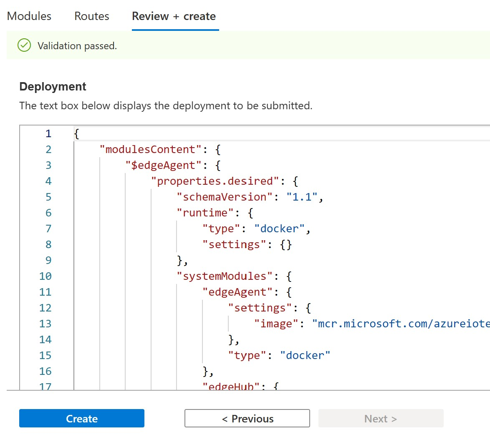
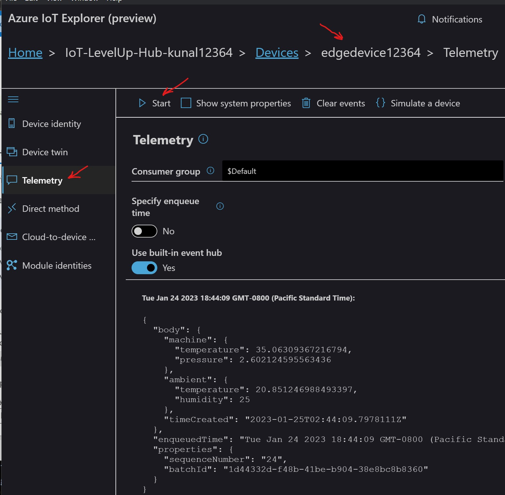
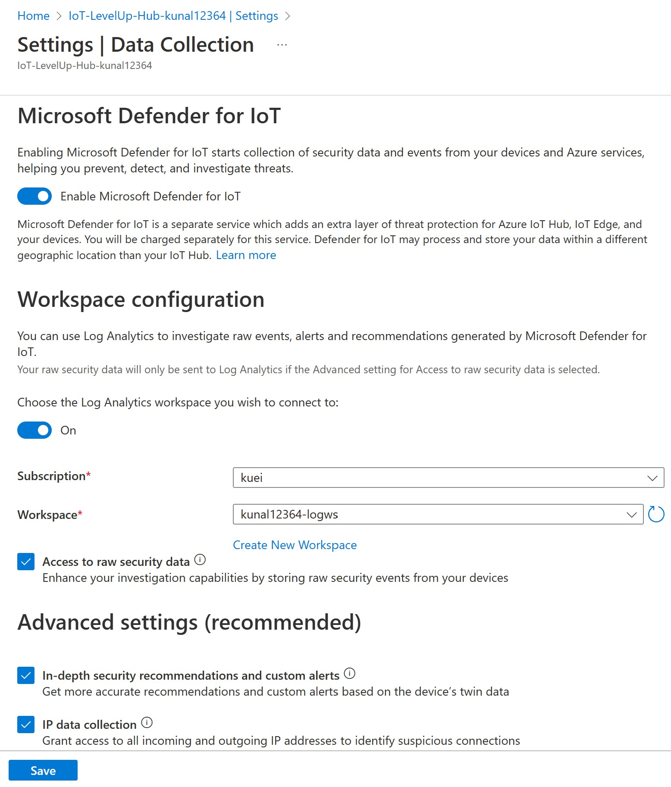
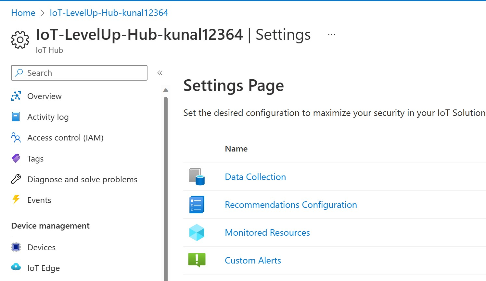

# IoT Edge & Defender for IoT Micro Agent Lab

## Lab 1: Install IoT Edge & Deploy Module on VM

### 1. SSH into VM and run following to install Moby (Docker), IoT Edge & Micro Agent

```
# Get Microsoft package list and add as source

    wget https://packages.microsoft.com/config/ubuntu/20.04/packages-microsoft-prod.deb -O packages-microsoft-prod.deb
    sudo dpkg -i packages-microsoft-prod.deb
    rm packages-microsoft-prod.deb

# Update package list and install Moby

    sudo apt-get update; \
    sudo apt-get install moby-engine

    # Check docker is running

    systemctl status docker

# Update package list and install IoT Edge and
micro agent

    sudo apt-get update;
    sudo apt-get install aziot-edge defender-iot-micro-agent-edge

# Configure IoT Edge runtime with Edge Device Connection String and apply configuration. Use connection string saved in Prerequisites Step 4

    sudo iotedge config mp --connection-string "***************"
    sudo iotedge config apply

# Check IoT Edge & Micro Agent status


    sudo iotedge system logs -- -f

    iotedge list

    sudo docker ps

    journalctl -u defender-iot-micro-agent –f

```

## 2. Deploy Simulated Temperature & Humidity Module on IoT Edge

# Portal

1. Open IoT Edge device in IoT Hub

2. Select Set Modules 

3. Add marketplace module 

4. Search for "Simulated Temperature Sensor", Select

5. Click Routes, review the route

6. Click Review+Create to see the full Deployment manifest, detailing all modules, routes and associated desired properties 

7. Click Create to deploy modules to IoT Edge

8. Open Cloud shell connected to VM to view portal and shell together. Check 

9. Open Azure Device Explorer and add IoTHub connection using saved IoT Hub connection string, open edge device 

10. View Telemetry in Device Explorer, click Telemetry and Start 

## Lab 2: Configure Defender for IoT in IoT Hub

1. In Azure Portal, open IoTHub, select settings & click "Secure your IoT Solution" button > 

2. Refresh page and open Data Collection setting 

3. Enable "Microsoft Defender for IoT, choose Log Analytics workspace created during prerequisites, enable "Access to raw security data" and save

4. Go back to previous pane and review , by default all are enabled.

5. Go back to previous pane and under Monitored Resources select your subscription and resource group. Defender will start monitoring resources under this group

6. Go back to previous and review available custom alerts that can be added. This allows us to choose specific alerts not configured by default.

7. By default microagent reports HIGH/MEDIUM/LOW priority events in 30/120/1440 minute intervals respectively. In this lab we will configure HIGH priority alert to 2 minutes to avoid waiting and change MEDIUM priority to HIGH for Process and Network activity. Open Azure Device Explorer, select IoT Edge device and under Module Identities open "DefenderIotMicroAgent" module and select Module twin. Copy following properties under desired properties.

    ```
    "CollectorsCore_PriorityIntervals": "2,120,1440",
    "Process_MessageFrequency": "High",
    "NetworkActivity_MessageFrequency": "High",

    ```
    

## Lab 3: Analytics

1. Open IoTHub and select Overview under the Defender menu on left blade. 

2. Review Resource health by severity, click for more details

3. Review your device alert by clicking your edge device

4. Open "Logs" under Monitoring menu on the left blade and close "Getting Started" and Wizard dialog to get to Query form.  Select scope to 


## Clean Up, open cloud shell

```
az group delete --name $resourceGroup
rm myconfig.log  
```
